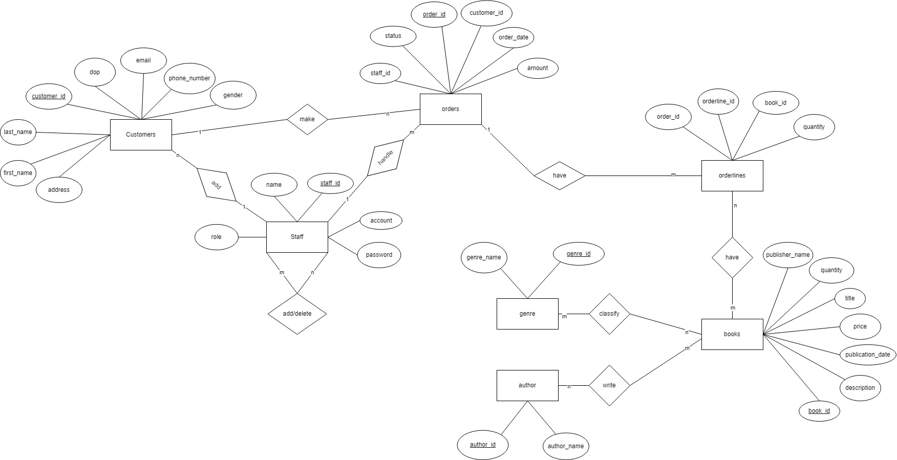
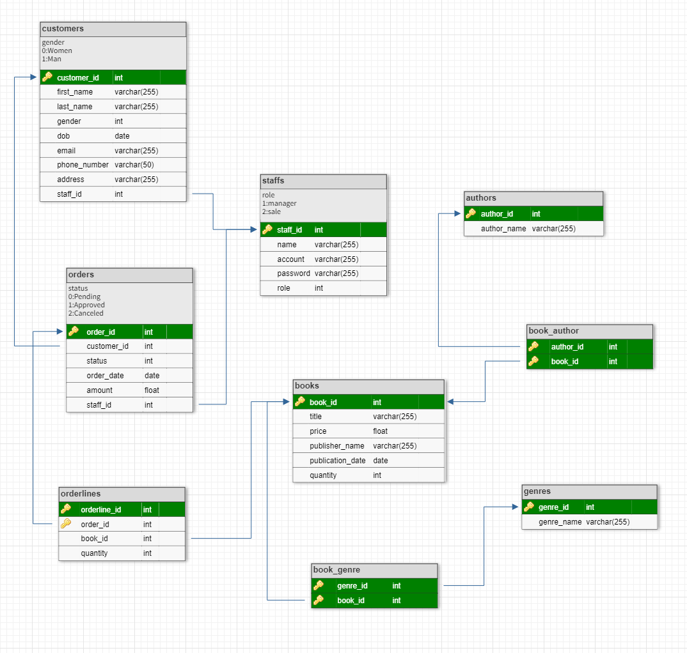

# BookStore Management Application

An application with only one protal - staff.  
Feature by roles:  
In our expectations, the staff may have these main functions: 
  - Make new orders
  - Search by given information​ (Based on the title, the publisher’s name, the author or the genre) 
  - Check (daily/monthly/annually) sales​ 
  - Manage book:​ 
    - Access to view the available books => Manage quantities​ 
    - Add new books in the systems​ 
    - Update book’s information (Change information/Delete books)​ 
  - Manage the information of customers (Name, phone number, address, d.o.b…)  
Manager: Add/Delete account of staffs​ 

## Technology Stack
* **Frontend:** [HTML, CSS, Bootstrap, Javascript]
* **Backend:** [Python Flask]
* **Database:** [SQL Server]

## Requirements
* [Visual Studio Code](https://code.visualstudio.com/)
* [SQL Server Management Studio](https://learn.microsoft.com/en-us/sql/ssms/download-sql-server-management-studio-ssms?view=sql-server-ver16)
* [Python](https://www.python.org/)
* [Flask](https://pypi.org/project/Flask/)

## Website Preview
### Admin Portal Preview
[!Demo]

## Project Structure
    ├── static          
    |   └── bootstrap
    |   └── css
    |   └── images
    |   └── js
    ├── templates                   # html files 
    ├── utils                       # code files
    ├── app.py              
    ├── bookstore_db.sql      # tables and queries used for this project
    ├── .gitignore
    ├── requirements.txt
    ├── LICENSE
    └── README.md
## Entity Relationship Diagram

## Schema

